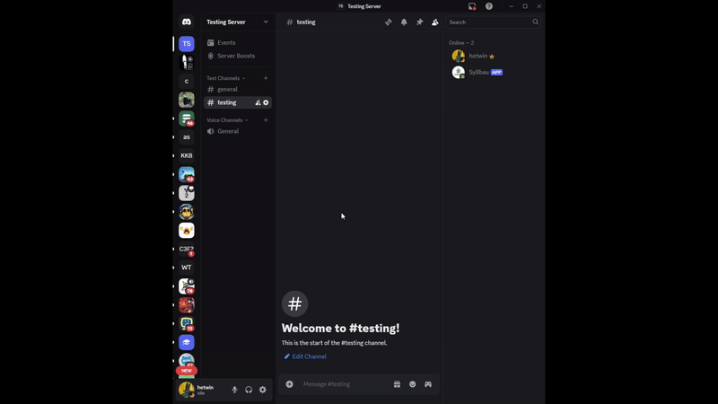

# Syllabee: Your AI-Powered Course Assistant

Syllabee is a sophisticated Discord bot designed to help students and educators manage and understand course syllabi effortlessly. By leveraging the power of Large Language Models (LLMs) and semantic search, the bot can parse PDF syllabi, answer questions in natural language, and provide key information on demand.


*(Placeholder for a GIF demonstrating the bot's features)*

---

## 🤖 For Students: Ask Your Syllabus Anything

Tired of hunting through PDFs for "when’s the midterm?" or "how much is the final worth?"  
syllabee makes your course documents interactive and helpful.

### ✨ Key Features
- 📎 **Upload & Forget** — Drop your PDF, and the bot handles parsing & storage.
- 🧠 **Ask Anything** — Use natural language: *"What’s the late policy?"*
- ⚡ **Fast Answers** — Get immediate, LLM-powered responses from your syllabus.
- 📚 **Course Management** — View and manage your syllabi via simple commands.
- 🔀 **Multi-Syllabus Routing** — It auto-detects which course you’re referring to.

---

## 🧑‍💻 For Recruiters: Tech Overview

This project demonstrates a production-ready AI system that integrates:
- **Semantic retrieval (pgvector)**  
- **LLM pipelines (LangGraph)**  
- **Multimodal ingestion (OCR + NLP)**  
- **Modern DevOps practices (Docker, FastAPI, async Discord bot)**

### System Architecture

The application is built with a decoupled, service-oriented architecture, consisting of three main components:

1.  **Discord Bot:** The user-facing component, built with `discord.py`. It handles user interactions and communicates with the backend API.
2.  **FastAPI Backend:** A Python-based API that serves as the application's core. It manages file uploads, data processing, and the AI workflows.
3.  **PostgreSQL Database:** A powerful relational database with the `pgvector` extension for storing structured data and vector embeddings.

```
[User on Discord] <--> [Discord Bot (discord.py)] <--> [FastAPI Backend] <--> [PostgreSQL (pgvector)]
```

### AI-Powered Syllabus Parsing & Q&A

The bot's intelligence is powered by a sophisticated AI pipeline built with **LangGraph**, a library for building stateful, multi-actor applications with LLMs.

**1. Syllabus Processing Workflow:**

*   **Hybrid OCR:** When a PDF is uploaded, it's first processed with `pdfplumber` for direct text extraction. If that fails, it falls back to a robust OCR engine (`pytesseract`) to handle scanned documents.
*   **Structured Data Extraction:** The extracted text is then passed to a Google Generative AI model (Gemini-1.5-Flash) with a detailed Pydantic schema. The LLM extracts key information (course name, professor, grading policy, etc.) and returns it as a structured JSON object.
*   **Semantic Chunking & Embedding:** The text is broken down into semantically meaningful chunks. Each chunk is then converted into a vector embedding using a Hugging Face Sentence Transformer model and stored in the `pgvector` database.

**2. Question-Answering Workflow:**

*   **Intelligent Routing:** When a user asks a question, an LLM-powered "router" determines which syllabus the question is about, handling ambiguous queries gracefully.
*   **Hybrid Search:** The system performs a hybrid search to retrieve the most relevant information:
    *   **Keyword Search:** A full-text search for direct matches.
    *   **Vector Search:** A semantic search to find conceptually related information.
    *   The results are combined and re-ranked to find the best possible context for answering the question.
*   **Answer Generation:** The retrieved context is passed to another LLM, which generates a clear, concise answer to the user's question.

### Tech Stack

*   **Backend:** FastAPI, Python 3.11
*   **Frontend (Bot):** `discord.py`
*   **Database:** PostgreSQL with `pgvector`
*   **AI/LLM Orchestration:** LangGraph, LangChain
*   **LLMs:** Google Generative AI (Gemini-1.5-Flash)
*   **Embeddings:** Hugging Face Sentence Transformers
*   **PDF Processing:** `pdfplumber`, `pytesseract`
*   **Containerization:** Docker, Docker Compose

---

## Getting Started

### Prerequisites

*   Docker & Docker Compose
*   Python 3.11
*   A Discord Bot Token

### Installation & Setup

1.  **Clone the repository:**
    ```bash
    git clone https://github.com/your-username/syllbau.git
    cd syllbau
    ```

2.  **Create a `.env` file:**
    Copy the `.env.example` file to `.env` and fill in the required values:
    ```
    DISCORD_TOKEN=your_discord_bot_token
    DISCORD_APP_ID=your_discord_app_id
    POSTGRES_USER=your_db_user
    POSTGRES_PASSWORD=your_db_password
    POSTGRES_DB=your_db_name
    HF_TOKEN=your_hugging_face_token
    PARSE_MODEL=gemini-1.5-flash
    ```

3.  **Run with Docker Compose:**
    ```bash
    docker-compose up -d --build
    ```

---

## Usage (Discord Commands)

*   `/upload <file>`: Upload a syllabus PDF.
*   `/ask <question>`: Ask a question about your syllabi.
*   `/list`: List your subscribed courses.
*   `/list_all`: List all syllabi in the system.
*   `/subscribe <syllabus_id>`: Subscribe to a syllabus.
*   `/unsubscribe <syllabus_id>`: Unsubscribe from a syllabus.
*   `/help`: Show a list of all available commands.

---

## Future Improvements

*   **Add a comprehensive test suite:** Implement unit and integration tests to ensure code quality and reliability.
*   **Proactive Notifications:** Automatically send reminders for upcoming due dates and exams.
*   **Web Interface:** Create a web-based dashboard for managing syllabi and viewing course information.
*   **Support for More File Types:** Add support for `.docx` and other common document formats.
